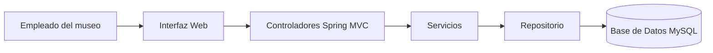

# Sistema de Registro de Visitas del Museo

## Resumen ejecutivo

### Descripción

Este repositorio contiene la solución para un sistema de registro de visitas de un museo local.
Su propósito es permitir a los empleados del museo registrar, consultar y administrar las visitas diarias de forma eficiente, segura y escalable.

### Problema identificado

Actualmente, el museo realiza el registro de visitas de forma manual en hojas y carpetas físicas, lo que provoca:

* Retrasos en procesos operativos
* Errores manuales en el conteo
* Falta de trazabilidad de la información
* Baja escalabilidad para el crecimiento del museo

### Solución

La solución propuesta consiste en una plataforma web desarrollada con Java y Spring Boot que permite:

* Automatizar el registro de visitas
* Centralizar la información en una base de datos
* Mejorar la experiencia del usuario
* Facilitar el mantenimiento del sistema

### Arquitectura

La solución está compuesta por:

* **Frontend:** HTML, CSS
* **Backend / API:** Java con Spring Boot (MVC)
* **Base de datos:** MySQL
* **Infraestructura:** Aplicación local con servidor embebido



## Tabla de contenidos

* [Resumen ejecutivo](#resumen-ejecutivo)
* [Requerimientos](#requerimientos)
* [Instalación](#instalación)
* [Configuración](#configuración)
* [Uso](#uso)
* [Contribución](#contribución)
* [Roadmap](#roadmap)
* [Wiki del proyecto](../../wiki)
* [Documentación externa](https://tudominio.readthedocs.io/)

## Requerimientos

### Infraestructura

* Servidor de aplicación: Spring Boot
* Servidor web: No aplica (embebido)
* Base de datos: MySQL
* Sistema operativo recomendado: Windows / macOS / Linux

### Software y dependencias

* Java: 17
* Maven: 3.8+
* Node.js: No aplica
* Docker: Opcional
* Git: 2.0+

### Paquetes adicionales

* Spring Boot
* Spring Web
* Spring Data JPA
* MySQL Driver

## Instalación

### Clonar repositorio

```bash
git clone https://github.com/MarMarielle/MuseoApp.git
cd MuseoApp
```

### Variables de entorno

```env
APP_PORT=8080
DB_HOST=localhost
DB_PORT=3306
DB_NAME=museo_db
DB_USER=root
DB_PASSWORD=1234
JWT_SECRET=secret_key
```

### Instalar dependencias

#### Backend

```bash
mvn clean install
```

#### Frontend

```bash
# No aplica
```

### Ejecutar ambiente de desarrollo

#### Backend

```bash
mvn spring-boot:run
```

#### Frontend

```bash
# No aplica
```

## Pruebas manuales

### Pruebas funcionales manuales

1. Iniciar la aplicación.
2. Acceder a `http://localhost:8080`.
3. Registrar una visita.
4. Validar:

   * Creación de registros
   * Edición de registros
   * Consulta de registros

### Pruebas automatizadas

```bash
mvn test
```

## Despliegue

### Producción en ambiente local

```bash
mvn clean package
java -jar target/app.jar
```

### Docker

```bash
docker build -t museo-app .
docker run -p 8080:8080 --env-file .env museo-app
```

### Heroku

```bash
heroku create museo-app
heroku config:set DB_HOST=...
heroku config:set DB_USER=...
heroku config:set DB_PASSWORD=...
git push heroku main
```

## Configuración

### Archivos principales

* `src/main/resources/application.properties`
* `.env`

### Ejemplo

```properties
server.port=8080
spring.datasource.url=jdbc:mysql://localhost:3306/museo_db
spring.datasource.username=root
spring.datasource.password=1234
spring.jpa.hibernate.ddl-auto=update
```

### Validaciones previas

* Base de datos creada
* Variables de entorno configuradas
* Puerto disponible
* Dependencias instaladas
* Credenciales válidas

## Uso

### Referencia para usuario final

El usuario final puede:

* Registrar visitas
* Consultar registros
* Editar información
* Eliminar registros

Manual:

* [Manual de usuario final](../../wiki/Manual-de-Usuario)
* [Documentación externa](https://tudominio.readthedocs.io/)

### Referencia para usuario administrador

El administrador puede:

* Gestionar registros
* Supervisar información
* Validar datos

Manual:

* [Manual de administrador](../../wiki/Manual-de-Administrador)

## Contribución

### 1. Clonar repositorio

```bash
git clone https://github.com/MarMarielle/MuseoApp.git
cd MuseoApp
```

### 2. Crear nueva rama

```bash
git checkout -b feature/nueva-funcionalidad
```

### 3. Guardar cambios

```bash
git add .
git commit -m "feat: nueva funcionalidad"
```

### 4. Subir rama

```bash
git push origin feature/nueva-funcionalidad
```

### 5. Enviar Pull Request

* Abrir un Pull Request hacia `main` o `develop`
* Describir el cambio realizado

### 6. Esperar revisión y merge

## Roadmap

* [ ] Reportes mensuales automáticos
* [ ] Exportación a Excel
* [ ] Implementación de login
* [ ] Control de usuarios
* [ ] Docker Compose
* [ ] CI/CD
* [ ] Pruebas automatizadas
