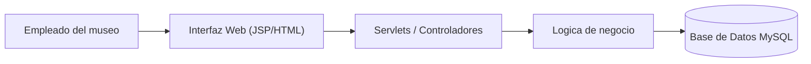

# Sistema de Registro de Visitas del Museo

## Resumen ejecutivo

### Descripción

Este repositorio contiene la solución para un sistema de registro de visitas de un museo local.  
Su propósito es permitir a los empleados del museo registrar, consultar y administrar las visitas diarias de forma eficiente, segura y escalable.

### Problema identificado

Actualmente, el museo realiza el registro de visitas de forma manual en hojas y carpetas físicas, lo que provoca:

* Retrasos en procesos operativos  
* Errores manuales en el conteo  
* Falta de trazabilidad de la información  
* Baja escalabilidad para el crecimiento del museo  

### Solución

La solución propuesta consiste en una aplicación web desarrollada con Java (Servlets y JSP) desplegada en Apache Tomcat 9 que permite:

* Automatizar el registro de visitas  
* Centralizar la información en una base de datos  
* Mejorar la experiencia del usuario  
* Facilitar el mantenimiento del sistema  

### Arquitectura

La solución está compuesta por:

* **Frontend:** HTML, CSS, JSP  
* **Backend:** Java (Servlets)  
* **Servidor de aplicaciones:** Apache Tomcat 9  
* **Base de datos:** MySQL  
* **Infraestructura:** Aplicación desplegada en servidor local  



---

## Tabla de contenidos

* [Resumen ejecutivo](#resumen-ejecutivo)  
* [Requerimientos](#requerimientos)  
* [Instalación](#instalación)  
* [Configuración](#configuración)  
* [Uso](#uso)  
* [Contribución](#contribución)  
* [Roadmap](#roadmap)  
* [Wiki del proyecto](../../wiki)  

---

## Requerimientos

### Infraestructura

* Servidor de aplicación: Apache Tomcat 9  
* Servidor web: Apache Tomcat 9  
* Base de datos: MySQL  
* Sistema operativo recomendado: Windows / macOS / Linux  

### Software y dependencias

* Java: 8 o superior  
* Maven: 3.6 o superior  
* Node.js: No aplica  
* Docker: Opcional  
* Git: 2.0+  

### Paquetes adicionales

* Servlet API  
* JSP  
* MySQL Driver  

---

## Instalación

### Clonar repositorio

```bash
git clone https://github.com/MarMarielle/MuseoApp.git
cd MuseoApp
```

### Generar archivo WAR

```bash
mvn clean package
```

El archivo generado se encontrará en:

```
target/MuseoApp.war
```

### Desplegar en Tomcat

1. Copiar el archivo `.war` en la carpeta `webapps` de Tomcat  
2. Iniciar el servidor Apache Tomcat  
3. Acceder desde el navegador:  

```
http://localhost:8080/MuseoApp
```

---

## Pruebas manuales

1. Iniciar el servidor Tomcat  
2. Acceder a la aplicación  
3. Registrar una visita  
4. Validar:

* Creación de registros  
* Edición de registros  
* Eliminación de registros  
* Consulta de registros  

---

## Despliegue

### Producción en ambiente local

```bash
mvn clean package
```

Copiar el archivo `.war` en el servidor Tomcat y ejecutarlo.

---

## Configuración

### Archivos principales

* `web.xml`  
* `context.xml` (opcional)  

### Ejemplo de conexión a base de datos

```properties
db.url=jdbc:mysql://localhost:3306/museo_db
db.user=root
db.password=tu_password
```

### Validaciones previas

* Base de datos creada  
* Credenciales configuradas  
* Servidor Tomcat en ejecución  
* Puerto 8080 disponible  

---

## Uso

### Referencia para usuario final

El usuario final puede:

* Registrar visitas  
* Consultar registros  
* Editar información  
* Eliminar registros  

Manual:

* [Manual de usuario final](../../wiki/Manual-de-Usuario)  

---

### Referencia para usuario administrador

El administrador puede:

* Gestionar registros  
* Supervisar información  
* Validar datos  

Manual:

* [Manual de administrador](../../wiki/Manual-de-Administrador)  

---

## Contribución

### 1. Clonar repositorio

```bash
git clone https://github.com/MarMarielle/MuseoApp.git
cd MuseoApp
```

### 2. Crear nueva rama

```bash
git checkout -b feature/nueva-funcionalidad
```

### 3. Guardar cambios

```bash
git add .
git commit -m "feat: nueva funcionalidad"
```

### 4. Subir rama

```bash
git push origin feature/nueva-funcionalidad
```

### 5. Enviar Pull Request

* Abrir un Pull Request hacia `main` o `develop`  
* Describir el cambio realizado  

---

## Roadmap

* [ ] Reportes mensuales automáticos  
* [ ] Exportación a Excel  
* [ ] Implementación de login  
* [ ] Control de usuarios  
* [ ] Docker Compose  
* [ ] CI/CD  
* [ ] Pruebas automatizadas  
